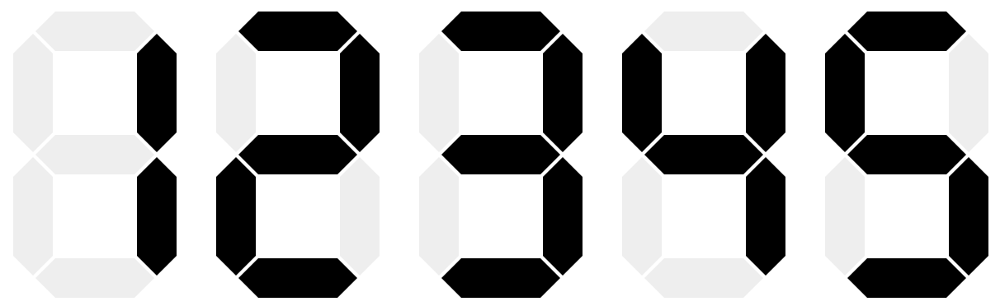

# react-digital-display

Configurable React component for displaying text, looking like digital display.


## Installation 

### npm

```shell
npm i react-digital-display
```

### pnpm

```shell
pnpm i react-digital-display
```

### yarn

```shell
yarn add react-digital-display
```

## Example

```tsx
import * as ReactDOM from 'react-dom';
import { Module7Segments, ReactDigitalDisplay } from 'react-digital-display';

ReactDOM.render(
  <ReactDigitalDisplay text="12345" module={Module7Segments} size={5} />,
  document.getElementById('root')
);
```


